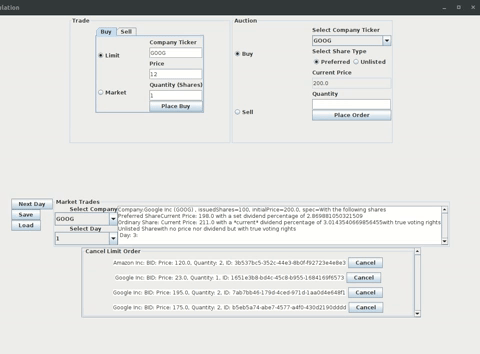

Java application that simulates the stock market with a zero sum order book.
Allows users to place limit and market orders.
Made in accordance of my knowledge of OOD principles at the time 

![] (leftpanel.gif) left panel 

 right panel
